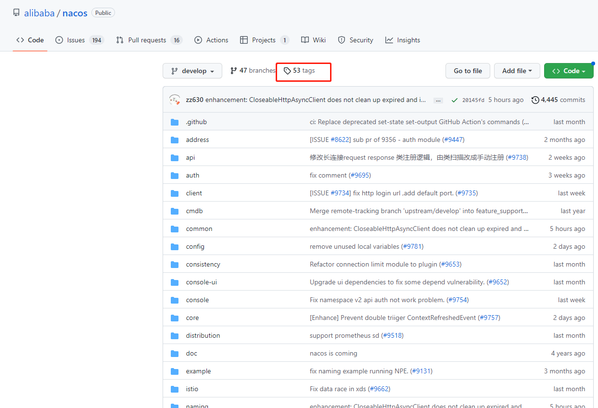
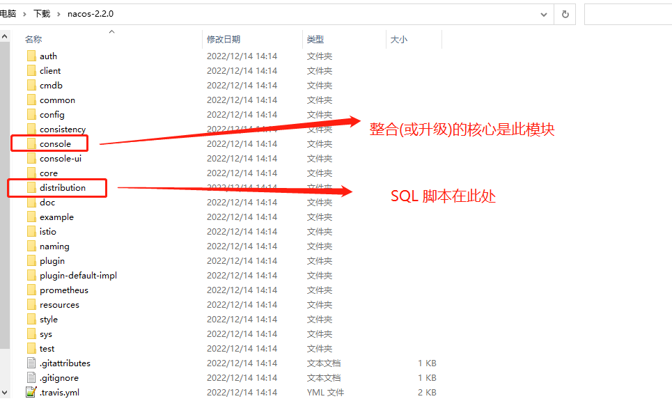
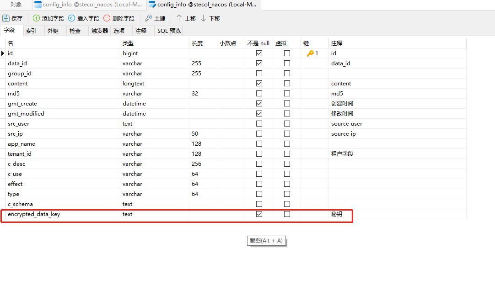

### 这是整合 nacos 源码模式启动的方式整合 Nacos服务到自己微服务示例项目(不再维更)
#### 源码来自 alibaba 官方开源项目： [nacos](https://github.com/alibaba/nacos)
#### 文献参考 ：[Nacos官方文档](https://nacos.io/zh-cn/docs/v2/quickstart/quick-start.html)

### **申明：此模式仅仅适用于开发环境，便于开发者灵活使用, 正式环境请直接使用 Nacos 官方镜像进行发布部署**

### [参考个人博客](https://www.cnblogs.com/Alay/p/15116662.html)

### 使用说明
#### 1、下载代码，推荐将代码整块迁移到个人项目中使用

#### 2、创建数据库,执行 SQL 脚本,为nacos 持久化DB 做准备（MySQL 为例）

#### 3、 修改配置文件 [/resource/application.yml](src/main/resources/application.yml) 文件中配置(可参考官方配置示例 [/resource/example](src/main/resources/example) )

### 整合说明
#### 1、下载 阿里巴巴  [官方源码](https://github.com/alibaba/nacos/tags)
##### 进入官方源码库

##### 选择版本

##### 选择源码压缩下载（.tar / .zip 二选一即可）

##### 解压

##### 整合和升级 nacos 源码，只需要将 console 模块拷贝到项目中即可

### 升级说明
#### 1、如果项目中已经使用了低版本的 Nacos,需要升级（v2.2.0 截止2023-01-06 是最新版）版本
#### 2、对数据库 表config_info 和 表his_config_info 新增字段 encrypted_data_key （秘钥）即可, 如下图

### 部署说明
#### 1、部署请以 Nacos 官方部署文档为准 [官方部署](https://github.com/nacos-group/nacos-docker)
#### 2、这是个人根据官方部署说明结合自己项目进行的部署 [示例](deploy) 抛砖引玉

